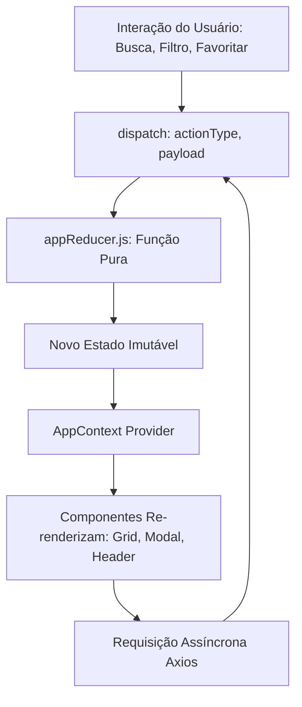

# Catálogo e Busca de Séries de TV

> **Projeto 1 — Programação Web Fullstack**  
> Aplicação Frontend desenvolvida em **React.js** seguindo a arquitetura **SPA (Single Page Application)** com consumo assíncrono de dados (**AJAX**).


## 🎬 Visão Geral do Projeto

Plataforma web interativa para exploração, busca e gerenciamento de séries de televisão. A aplicação permite aos usuários pesquisar séries em tempo real, filtrar por gênero, ordenar por classificação, visualizar detalhes através de uma janela modal e gerenciar uma lista persistente de títulos favoritos.

A solução foi desenvolvida integralmente no lado cliente com **React 18** e empacotada com **Vite**.

---

## 🎯 Atendimento aos Requisitos da Disciplina


### Conceito de SPA (Single Page Application)

A plataforma é uma **Single Page Application** pura:
- **Ponto Único de Entrada**: O arquivo [`index.html`](index.html) entrega apenas a estrutura básica com a tag `<div id="root"></div>`, na qual o React monta a árvore de componentes (`ReactDOM.createRoot`).
- **Navegação Dinâmica sem Recarregamento**: A alternância entre a visão do catálogo geral e a lista de "Meus Favoritos" é realizada através de controle de estado (`activeTab`) gerenciado pelo Reducer, sem qualquer disparo de requisição HTTP síncrona por nova página HTML ou redirecionamento no navegador.
- **Feedback Imediato**: Modais, paginação e buscas atualizam trechos cirúrgicos do DOM virtual do React, preservando o estado e proporcionando fluidez de aplicativo nativo.

---

### Consumo de API JSON Aberta via AJAX

A aplicação consome a **[TVMaze API](https://www.tvmaze.com/api)**, uma API pública e aberta em conformidade com as recomendações do catálogo *public-apis*.

#### Endpoints Consumidos:
1. `GET /shows?page=0`: Recuperação da listagem paginada padrão de séries para popular o catálogo principal.
2. `GET /search/shows?q={query}`: Busca textual dinâmica de títulos de acordo com o termo digitado pelo usuário.
3. `GET /shows/{id}?embed[]=episodes&embed[]=cast`: Consulta dos detalhes aprofundados da série, trazendo em uma única requisição os dados de metadados, a lista completa de episódios e o elenco de atores.

#### Implementação AJAX com Axios:
As chamadas são centralizadas na instância [`src/api/apiClient.js`](src/api/apiClient.js) e encapsuladas no serviço [`src/api/tvMazeService.js`](src/api/tvMazeService.js):
- **Timeout configurado (10s)** para evitar esperas infinitas caso o servidor externo oscile.
- **Interceptors de resposta**: Capturam falhas de rede, timeouts (`ECONNABORTED`), erros HTTP 404 e 500, convertendo-os em mensagens amigáveis em português antes de repassar ao estado da aplicação.
- **Tratamento de ciclo de vida assíncrono**: Transições de estado controladas (`FETCH_START` ➔ `FETCH_SUCCESS` ou `FETCH_ERROR`) garantem a exibição de loaders (*skeletons*) e mensagens de erro com possibilidade de nova tentativa (*retry*).

---

### Hook Avançado do React.js: useReducer e useMemo

O projeto implementa **dois** dos hooks requeridos, com destaque para a arquitetura com **`useReducer`**:

#### 1. `useReducer` (Gerenciador Central de Estado):
Em vez de espalhar múltiplos `useState` isolados, a aplicação unifica o estado em uma máquina de estados finita previsível através do [`src/reducers/appReducer.js`](src/reducers/appReducer.js) e do Context Provider [`src/context/AppContext.jsx`](src/context/AppContext.jsx):

```javascript
// Exemplo de transição controlada no reducer
case ACTION_TYPES.FETCH_START:
  return { ...state, loading: true, error: null };
case ACTION_TYPES.FETCH_SUCCESS:
  return { ...state, loading: false, shows: action.payload };
case ACTION_TYPES.FETCH_ERROR:
  return { ...state, loading: false, error: action.payload };
```

Ações gerenciadas:
- Controle de requisições (`FETCH_START`, `FETCH_SUCCESS`, `FETCH_ERROR`).
- Busca e filtragem (`SET_SEARCH_QUERY`, `SET_GENRE_FILTER`, `RESET_FILTERS`).
- Paginação e ordenação (`SET_PAGE`, `SET_SORT_BY`, `SET_SORT_ORDER`).
- Gestão de favoritos (`ADD_FAVORITE`, `REMOVE_FAVORITE`, `LOAD_FAVORITES`).
- Navegação por abas (`SET_ACTIVE_TAB`).
- Modal de detalhes assíncrono (`OPEN_MODAL`, `CLOSE_MODAL`, `SET_MODAL_DATA`, `SET_MODAL_ERROR`).

#### 2. `useMemo` (Otimização Computacional):
Em [`src/App.jsx`](src/App.jsx), o hook `useMemo` é empregado para calcular a lista final de séries (`filteredAndPaginatedShows`):
- Filtra a lista ativa por gênero (*Action, Drama, Comedy, etc.*).
- Ordena os itens pela nota média de avaliação (*rating*).
- Realiza o fatiamento (*slice*) para a paginação cliente.
- Garante que essas operações matemáticas e de iteração em arrays só sejam reprocessadas quando as dependências reais (`shows`, `favorites`, `activeTab`, `genreFilter`, `currentPage`) forem alteradas.

---

### Biblioteca Externa: Material-UI (MUI v5)

Foi escolhida a biblioteca **Material-UI (MUI)** (`@mui/material`), garantindo responsividade, acessibilidade e harmonia visual:

- **Layout e Estrutura**: `Container`, `Box`, `Grid` (sistema de grid baseado em 12 colunas responsivas para smartphones, tablets e desktops).
- **Apresentação de Dados**: `Card`, `CardMedia`, `CardContent`, `CardActions`, `Chip`, `Rating`, `Badge`.
- **Feedback e Carregamento**: `Skeleton` (efeito de carregamento dinâmico tipo *shimmer*), `Alert`, `AlertTitle`.
- **Navegação e Controles**: `Tabs`, `Tab`, `Pagination`, `Button`, `IconButton`.
- **Formulários e Filtros**: `TextField`, `Select`, `MenuItem`, `FormControl`, `InputAdornment`.
- **Diálogos Modais**: `Dialog`, `DialogTitle`, `DialogContent`, `DialogActions` para renderização da ficha técnica e episódios da série.
- **Ícones**: Pacote `@mui/icons-material` com `SearchIcon`, `FavoriteIcon`, `StarIcon`, `CloseIcon`, entre outros.

---

## 🏗 Arquitetura e Funcionamento do Código

### Estrutura de Pastas e Responsabilidades

A estrutura segue o padrão de arquitetura modular orientada a responsabilidades:

```text
src/
├── api/                   # Camada de comunicação HTTP
│   ├── apiClient.js       # Instância Axios, baseURL e interceptores de erro
│   └── tvMazeService.js   # Funções de requisição aos endpoints da TVMaze
├── components/            # Componentes visuais da interface
│   ├── common/            # Componentes reutilizáveis (Loading, ErrorState, EmptyState)
│   ├── favorites/         # Botão de favoritar com animação e controle de estado
│   ├── layout/            # Estrutura mestra (Header, MainLayout)
│   ├── media/             # Componentes de mídia (MediaCard, MediaGrid, MediaModal)
│   ├── navigation/        # Navegação por abas (Catálogo / Favoritos)
│   └── search/            # Barra de pesquisa e seleção de gênero
├── context/               # Contexto React global
│   └── AppContext.jsx     # Provider que expõe state e dispatch via useReducer
├── hooks/                 # Custom Hooks
│   ├── useDebounce.js     # Debounce para busca sem disparar requests a cada tecla
│   └── useLocalStorage.js # Sincronização automática do estado com o localStorage
├── reducers/              # Lógica de negócio e estado imutável
│   ├── actionTypes.js     # Constantes nomeadas de todas as ações
│   ├── appReducer.js      # Função redutora pura com tratativa das ações
│   └── initialState.js    # Definição do estado inicial da aplicação
├── utils/                 # Constantes e funções auxiliares
│   ├── constants.js       # Lista de gêneros e itens por página
│   └── formatters.js      # Utilitários de sanitização e formatação de texto/data
├── App.jsx                # Componente orquestrador da interface
└── main.jsx               # Ponto de entrada do React DOM
```

---

### Fluxo de Estado Global (Context API + useReducer)

A aplicação utiliza o padrão de fluxo de dados unidirecional:



1. O componente dispara uma ação (`dispatch({ type: ACTION_TYPES.XYZ, payload })`).
2. O `appReducer` recebe o estado atual e a ação, retornando um novo objeto de estado de forma imutável.
3. O `AppContext` notifica os componentes que consomem aquele pedaço de estado (`useAppState()`).
4. Os componentes reagem com transições visuais instantâneas.

---

### Camada de Serviços e Tratamento de Erros

Todas as requisições AJAX passam por uma camada de proteção:
- **Resiliência a Falhas**: Se o usuário estiver sem internet ou o serviço externo estiver fora do ar, o componente [`ErrorState.jsx`](src/components/common/ErrorState.jsx) é renderizado com um botão "Tentar Novamente", permitindo recuperação sem necessidade de atualizar a página.
- **Sanitização de Dados**: O componente de modal trata dados incomuns (sinopses contendo tags HTML usando sanitização e imagens não disponíveis com fallbacks visuais elegantes).

---

### Otimizações de Desempenho

1. **Debounce na Busca (`useDebounce`)**:
   - Evita o chamado *request flooding*. O usuário pode digitar livremente; a requisição para a API só é disparada 300ms após a última tecla digitada.
2. **Memorização de Cálculos (`useMemo`)**:
   - As operações de ordenação e filtro ocorrem em memória sem disparar requisições desnecessárias quando o usuário apenas navega entre páginas da listagem atual.
3. **Persistência Local (`useLocalStorage`)**:
   - As séries favoritadas são gravadas no `localStorage` do navegador sob a chave `cinewave_favorites`. Ao reabrir ou atualizar a aba, os favoritos permanecem disponíveis imediatamente.

---

## ⚡ Funcionalidades da Aplicação

- [x] **Catálogo Completo de Séries**: Navegação fluida pelas séries de TV mais populares da TVMaze API.
- [x] **Busca em Tempo Real com Debounce**: Pesquisa textual instantânea por título da obra.
- [x] **Filtro por Gênero**: Filtragem dinâmica por categorias (Ação, Comédia, Drama, Ficção Científica, Fantasia, Terror, etc.).
- [x] **Ordenação por Avaliação**: Apresentação ordenada de títulos com base na nota dos usuários e críticos.
- [x] **Ficha Técnica em Modal Detalhado**:
  - Imagem do pôster em alta definição.
  - Avaliação, status de exibição, emissora original e data de estreia.
  - Sinopse completa da obra.
  - **Aba de Elenco**: Lista de atores com suas respectivas fotos e nomes de personagens.
  - **Aba de Episódios**: Lista de temporadas e episódios com suas respectivas datas e sinopses.
- [x] **Sistema de Favoritos**:
  - Adição/remoção de séries favoritas com clique no ícone de coração.
  - Contador dinâmico de favoritos no topo da aplicação.
  - Aba exclusiva "Meus Favoritos" para rápida consulta dos itens salvos.
  - Persistência automática no `localStorage`.
- [x] **Paginação**: Divisão organizada em páginas de 12 itens para manter alta performance de renderização.
- [x] **Layout Responsivo**: Interface adaptável a telas mobile, tablets e monitores widescreen.

---

## 🛠 Tecnologias Utilizadas

- **Biblioteca Principal:** [React 18](https://react.dev/)
- **Ferramenta de Build:** [Vite](https://vitejs.dev/)
- **Cliente HTTP / AJAX:** [Axios](https://axios-http.com/)
- **Biblioteca de Componentes e UI:** [Material-UI (MUI v5)](https://mui.com/material-ui/)
- **Biblioteca de Ícones:** [MUI Icons](https://mui.com/material-ui/material-icons/)
- **Estilização e Temas:** [Emotion](https://emotion.sh/)
- **API Consumida:** [TVMaze Public API](https://www.tvmaze.com/api)

---

## 🚀 Ferramentas de Apoio Ultilizadas

   Analise e estruturação do código feita com o apoio do Gemini.

## 🚀 Instruções de Instalação e Execução

### Pré-requisitos
- [Node.js](https://nodejs.org/) versão 18.x ou superior instalada.
- Gerenciador de pacotes `npm` ou `yarn`.

### Passo a Passo

1. **Clone ou navegue até o diretório do projeto:**
   ```bash
   cd Projeto-1---REACTJS
   ```

2. **Instale as dependências do projeto:**
   ```bash
   npm install
   ```

3. **Inicie o servidor de desenvolvimento:**
   ```bash
   npm run dev
   ```

4. **Acesse a aplicação no navegador:**
   Abra o endereço exibido no terminal (geralmente [http://localhost:5173](http://localhost:5173)).

---

## 👥 Autoria

Mteus Rubio Durão
